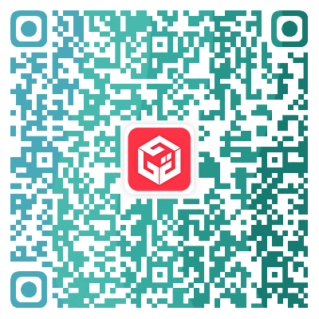

# 写在前面

- 本仓库持续更新，欢迎star

- 本仓库所有项目均可兼职/全职去做，但建议前期作为兼职/副业。
- 部分项目本人在做，因此可能存在`aff`，如您比较介意，可手动删除链接中的`aff`（大部分`aff`对双方都有好处，建议保留哈，赚点奶粉钱，提前谢过）。
- 大部分项目都没啥门槛，也不需要编程技术，但如果您有流量还不错的网站或自媒体账号，效果会更好。
- 有部分项目适合线下做，社牛可试试。
- 也欢迎推荐其他副业项目。

# 项目介绍

## 金融财经

之所以把金融类项目放在前面，是因为这种项目大部分都是被动收入，越到后期越客观。但相对来说，受制于监管，推广也不太好做。我这里介绍的都是合法项目，有人脉或者有推广渠道的可试试。

### 卡友合伙人

这是一个POS机相关的项目，0门槛，0费用，被动收入客观，线上线下均可做，具体请参考[合伙人文档](docs/卡友合伙人.md)。也可直接扫码加入，通过APP内了解详细的政策和奖励。

### 股票实盘

这里说的**股票实盘**，是指A股开盘期间，股票大V实时指示买卖点，时效性比较强。听到这里，你可能感觉是杀猪盘，其实也有合规的平台在做，像爱股圈、和讯、微博之类的，知名大V，比如Joker皇、金融小妖女、浮光之类的，在这些平台是有投顾资质的。那么怎么赚钱呢？一般官方订阅挺贵的，每月可能要几千。因此出现了黄牛，也就是转发群，我订阅过几个，买的人还挺多的，每个月每个大V几十块钱就可以了。如果能找到靠谱的黄牛/渠道（甚至你自己当黄牛，有一定风险），利润还是很可观的，推得越多，后面订的就是纯赚的，毕竟股民那么多，而且续订率还挺高的。现在很多黄牛不太稳定，我就不推荐了，就只是说说思路。

## 拉新/联盟

主要是各类`affiliate`进行拉新，这里主要列了返现金能提现的平台。有些人可能比较反感这种方式，感觉把新用户给卖了。其实，拉新并不意味着是纯粹的拉人头，这种一般对双方都有好处，收益是平台出，三方各有好处，平台得了用户，用户得了服务，拉新者得了奖励，没必要反感。

### Racknerd

[Racknerd](https://my.racknerd.com/aff.php?aff=12266)是国人这两年用得比较多的一个便宜VPS的服务商，以高性价比著称，最便宜的VPS低到**[10.28美金每年](https://my.racknerd.com/aff.php?aff=12266&pid=695)**，黑色星期五还能更便宜。其在北美、欧洲和亚洲的 17 个不同地点拥有 20 个数据中心，通过你的链接购买VPS，你将获得佣金，50美金起提。

## 虚拟资料/课程/专栏

这类其实就是卖课，如果不是你自己录，自己卖或者有优质资源，那不太建议做，很多资源早就流出了，复制成本低，不好做。优质资源比如[小报童](https://xiaobot.net/home.html)、[知识星球](https://www.zsxq.com/)这种保持持续更新的感觉还有得做。小报童专栏如果设置了合伙人计划，则可以通过该链接获取返佣，因为小报童官方没有搜索功能，看到有些小报童专栏导航站就采用了此类模式。

## 会员/卡券/电话卡

主要是找好货源和销售渠道，这个对于有电商、自媒体经验的朋友们比较友好。如果自己有人脉，也可通过朋友圈或发卡系统进行拓客。这种方式一般客单价利润比较低（不到10%，除非有比较好的单品），主要靠走量和复购，需要有耐心。

### 货源

**重要：本人和下面任何货源网站无任何利益往来，仅用于分享目的，商品来源是否合法，请自行甄别！！**

#### 智云数卡

有各类会员和优惠券，可对接API·电商·闲鱼·各大系统商，实现自动发货，拿货价看代理等级，不同代理等级费用不同，具体货源查看[商品目录 - 智云数卡权益-八年老牌服务终端](https://vip.15la.cn/cata)

### 发卡系统/虚拟商城

发售渠道首选还是闲鱼、淘宝这种，流量比较大，但有些会员/优惠券对这些渠道有限价要求。如果你的产品有适用人群或者私域运营，可考虑下面的

#### 发卡系统

免费开源，在开发者群体里用得还是比较多的。下面列了几个流行的供参考

- [lizhipay/acg-faka: 个人发卡源码，发卡系统，二次元发卡系统，二次元发卡源码，发卡程序，动漫发卡，PHP发卡源码，异次元发卡](https://github.com/lizhipay/acg-faka)
- [assimon/dujiaoka: 🦄独角数卡(自动售货系统)-开源站长自动化售货解决方案、高效、稳定、快速！🚀🚀🎉🎉](https://github.com/assimon/dujiaoka)

#### 卡商云

付费产品，系统比较完善，适合小白，[首页_卡商云 - 虚拟数字权益生态服务平台](http://www.kashangyun.com/)

#### 卡速售

付费产品，系统比较完善，适合小白，[卡速售-虚拟电商解决方案提供商-助力企业数字化新零售社交电商发展](https://www.kasushou.com/)

## 远程工作/freelancer/外包

### Upwork

一个知名的freelancer平台，如果英语较好，可以尝试下，全职兼职都有。注意：投递需要花钱的，一般也会有英语面试，所以尽量找和自己非常对口的，免得浪费。可以去小红书查下攻略啊。

链接：[Upwork | The World’s Work Marketplace](https://www.upwork.com/)

### Fiverr

一个知名的freelancer平台，如果英语较好，可以尝试下，全职兼职都有。注意：投递需要花钱的，一般也会有英语面试，所以尽量找和自己非常对口的，免得浪费。可以去小红书查下攻略啊。

链接：[Upwork | The World’s Work Marketplace](https://www.upwork.com/)

### Fiverr

另一个知名freelancer平台，有点像闲鱼，各种服务都可以提供，等待客户联系，这上面做开发之类的感觉不太好，可以搞一些偏门的，比如帮老外买本地的东西/服务，我见过一个美国人专门帮人做地址验证（中国人注册美国公司或其他服务有时需要邮寄资料或者什么码之类的到你的地址），成单不少。有AI辅助，英语不需要太好。

链接：[Fiverr | Freelance services marketplace | Find top global talent](https://www.fiverr.com/)

### 电鸭社区

专注远程工作的一个社区，全职兼职都有，主要为IT方面的工作，国外招聘的比较多，一般对英语有要求，可以尝试用英语发帖；还有区块链方面、找合伙人的，这种谨防诈骗/白嫖。

链接：[电鸭社区-专注远程工作招聘交流-远程工作，从电鸭开始](https://eleduck.com/)

### HiringCafe

一个工作搜索网站，也有国内的岗位，有远程，也有需要坐班的，可以看看。

链接：[HiringCafe - Job Search 2025](https://hiring.cafe/)

### 程序员客栈
专为程序员服务的软件外包对接平台，定位是自由工作平台，为程序员等互联网相关人员提供线上工作机会。平台当前累积了111万优秀开发者，覆盖多个技术领域，程序员、产品经理、设计师等互联网相关人员，都能在上面找到适合自己的项目。支持自由、远程和兼职工作，还可以按需雇佣，工作模式非常多，工作的内容和报酬都是明码标价。

链接：[程序员客栈-领先的程序员自由工作平台-程序员兼职](https://www.proginn.com/)

### 猪八戒
各种任务都有，感觉单价不是太高，竞争激烈。

链接：[猪八戒网-品质企业服务 就找猪八戒](https://www.zbj.com/)

### 实现网
平台可为企业提供名企背景的、靠谱的开发设计兼职人才和自由职业者,满足企业项目外包、驻场开发、远程兼职、技术咨询等短期人力需求。可以展示项目外，还能展示每个开发者技能和经历，方便企业快速寻找符合需求的开发者。。

链接：[实现网 - 按需雇佣 BAT 工程师、设计师](https://shixian.com/)

## 线下

等待补充
